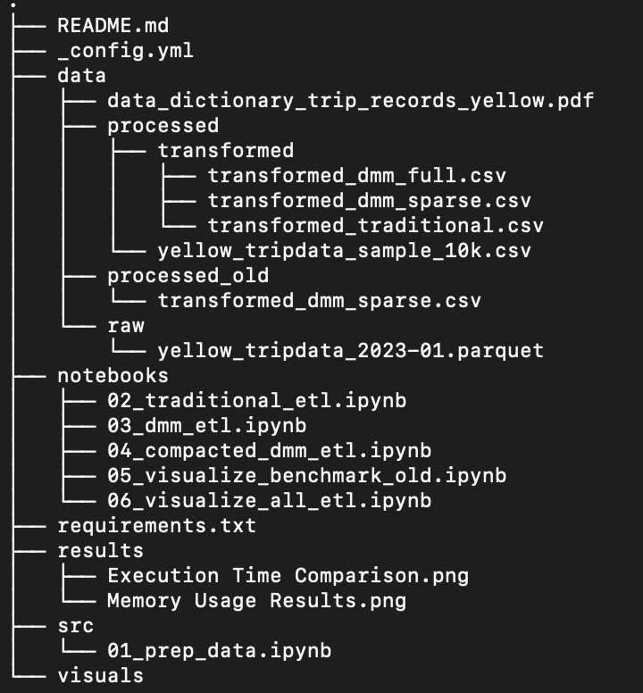
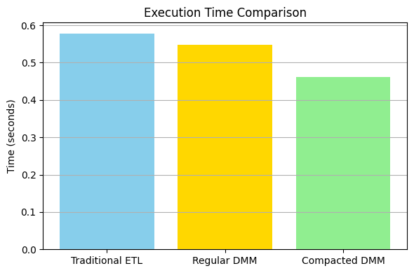
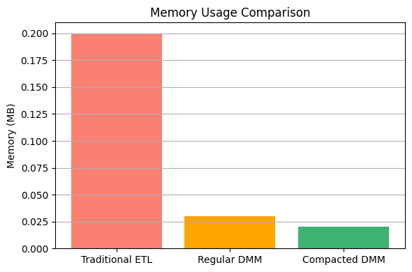

# dmm-vs-lookup-etl  
ETL Pipelines Optimization Research Project

## 📊 Evaluating Dynamic Mapping Matrix (DMM) vs Traditional ETL Mapping for Optimized Data Processing

This repository contains the codebase, documentation, and benchmark results for my senior research project, which explores the performance differences between traditional **ETL (Extract, Transform, Load)** mapping methods and a matrix-based approach called the **Dynamic Mapping Matrix (DMM)**.

## 🧠 Project Overview

As modern data systems grow in scale and complexity, optimizing ETL pipelines becomes critical to ensure fast and memory-efficient processing. Traditional ETL methods typically rely on lookup tables and rule-based transformations, which can become computationally expensive at scale.

This project empirically compares:
- **Traditional ETL Mapping** using Pandas dictionary lookups.
- **Regular DMM Mapping**, simulating a large sparse matrix with many active rules.
- **Compacted DMM Mapping**, where only a small subset of transformation rules are applied (emulating DMM compaction logic from the METL framework).

All three approaches are evaluated using real-world data from the NYC Taxi & Limousine Commission.

## 📂 Project Structure

## 📈 Overview

We implemented and profiled the following transformation pipelines:

- **Traditional ETL:** Uses Pandas dictionary lookups.
- **Regular DMM:** Uses a 100×100 sparse matrix with all mappings active.
- **Compacted DMM:** Emulates filtering by using only a small subset (6 of 100 mappings).

## 🧪 Benchmark Setup

- Dataset: [yellow_tripdata_2023-01.parquet](https://d37ci6vzurychx.cloudfront.net/trip-data/yellow_tripdata_2023-01.parquet)
- Profiling tools: `memory_profiler`, `time`
- Consistency ensured via: `gc.collect()` and `del` statements between runs
- **Note:** Early results were inconsistent due to caching effects; resolved by improving memory reset logic.

## 📊 Results Highlights

- Compacted DMM showed the best performance: lowest memory and fastest execution.
- Full benchmark figures available in the `results/` and `visuals/` directories.

## 📈 Performance Metrics

Benchmarks were conducted on all three transformation strategies using:

- **Execution Time** (`time`)
- **Memory Usage** (`memory_profiler`)

Early results revealed inconsistencies due to object caching. These were resolved by using `del` and `gc.collect()` between runs to ensure fair measurement.

### ✅ Final Results:
- **Compacted DMM** had the lowest memory usage (0.02 MB) and fastest execution time (0.46 sec).
- **Traditional ETL** was the slowest and used the most memory (0.20 MB).
- **Regular DMM** fell in between.S

## 🔧 Tools & Technologies
- Python 3
- Pandas, Numpy
- Jupyter Notebook
- memory_profiler, time
- del (Delete) and gc (Garbage collection)
- NYC TLC Taxi Trip Dataset ([Jan 2023 Yellow](https://d37ci6vzurychx.cloudfront.net/trip-data/yellow_tripdata_2023-01.parquet))

## 📚 Research Goals

- Benchmark DMM vs. traditional lookup-based mapping in realistic scenarios
- Quantify trade-offs in transformation speed and memory efficiency
- Explore future use of matrix compaction for scalable ETL pipelines

## 🙋 About Me

I'm a senior at Eastern Connecticut State University, double majoring in Computer Science and Business Information Systems, with a minor in Data and Information Engineering. My academic and project background centers on data engineering, and this research supports my goal of contributing to real-world ETL optimization practices.

📬 Feedback and suggestions are welcome.  
📁 See [`results/`](./results) for figures and paper.  
📎 Code and transformations live in [`notebooks/`](./notebooks)